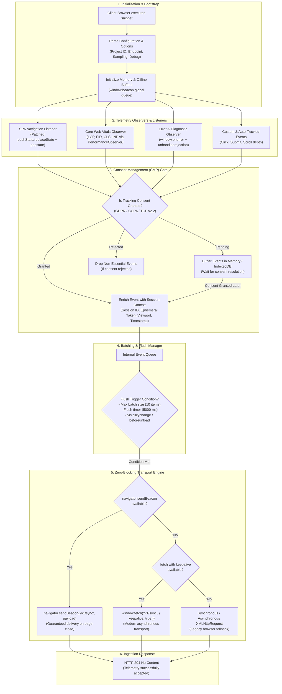

# Level 1: Client Web Tag Telemetry Architecture (`web-tag`)

This document specifies the client-side telemetry tracker architecture, detailing the lifecycle of the JavaScript beacon tag from loading to event transmission.

---

## 1. Client Tag Lifecycle & Transport Flowchart

---

## 2. Technical Specifications

### Budget & Footprint Constraints
* **Total Gzipped Bundle Size**: `< 5 KB`
* **Zero External Dependencies**: Pure Vanilla ES2022+ with automated minification via `esbuild`.
* **Zero Main Thread Jitter**: Performance measurements run inside `requestIdleCallback` or decoupled microtasks.

### Transport Strategy Hierarchy
1. **`navigator.sendBeacon()`**: Primary delivery channel. Does not block document teardown and guarantees transmission during user navigation or tab closure.
2. **`fetch()` with `keepalive: true`**: Secondary modern transport used when payload structure or headers require custom POST configurations.
3. **`XMLHttpRequest`**: Graceful degradation fallback for older browser environments.

### Privacy & Consent Compliance
* Ingestion honors Google Consent Mode v2 and IAB Europe TCF v2.2 signals.
* When consent state is pending, telemetry events are queued in a transient memory buffer. If consent is explicitly denied, non-essential buffers are purged without making network calls.
