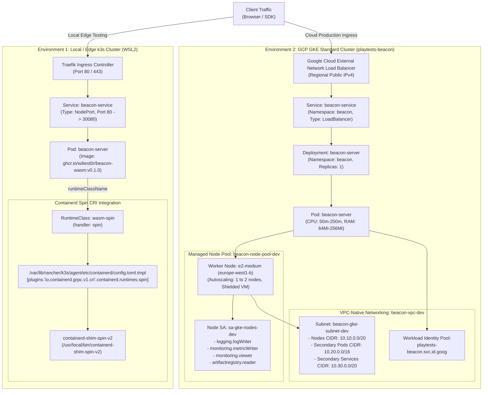

# Level 3: Edge & Kubernetes Runtime Layer (`deploy` & GKE)

This document details the container and WebAssembly orchestration layer across both **Local/Edge (WSL2 k3s)** and **Cloud (GCP GKE Standard)** environments.

---

## 1. Dual-Runtime Orchestration Flowchart

---

## 2. Infrastructure Comparison

| Metric / Dimension | Local / Edge k3s | Cloud GKE Standard |
| :--- | :--- | :--- |
| **Location** | Local WSL2 / Ubuntu Edge Node | GCP `europe-west1-b` (Single Zone) |
| **Management Cost** | $0.00 (Self-hosted) | $0.00 Control Plane (Google Cloud Free Tier Zonal Cluster) |
| **Ingress Engine** | Traefik v2 (k3s embedded) | Google Cloud External L4 Network Load Balancer |
| **Container Engine** | containerd with Spin shim | Google Container-Optimized OS (COS) |
| **WASM Execution** | `containerd-shim-spin-v2` | Native container / Spin shim daemonset |
| **Network Model** | Flannel (Host-GW / VXLAN) | VPC-Native secondary CIDR ranges (Pods & Services) |
| **Identity / IAM** | Local Kubeconfig / RBAC | GCP Workload Identity Federation (`.svc.id.goog`) |
| **IaC Automation** | Shell scripts (`deploy/k3s-setup.sh`) | HCP Terraform declarative IaC (`gke.tf` & `k8s_manifests.tf`) |

---

## 3. Kubernetes Declarative Manifest Structure

In accordance with GitOps standards, all Kubernetes cloud resources are provisioned directly through HCP Terraform's declarative `kubernetes` provider:

1. **Namespace (`beacon`)**: Dedicated boundary isolating telemetry pods from system services.
2. **RuntimeClass (`wasm-spin`)**: Registered runtime handler pointing to `spin` for native WASM execution.
3. **Deployment (`beacon-server`)**: Configures zero-downtime rolling updates, resource limits (`250m` CPU / `256Mi` RAM), and environment variable binding (`ENVIRONMENT=dev`, `APP_VERSION=0.1.0`).
4. **Service (`beacon-service`)**: Exposes port `80` with `type: LoadBalancer`, triggering GCP Cloud Load Balancing to allocate a static public IPv4 address.
