# Level 4: Cloud Serverless & Artifact Registry (`terraform-central`)

This document details the multi-environment serverless architecture provisioned in **Google Cloud Platform (`playtests-beacon`)** via **HCP Terraform (`PlayTests`)**.

---

## 1. Multi-Environment Serverless Topology

```mermaid
flowchart TD
    %% =========================================================================
    %% ENVIRONMENTS
    %% =========================================================================
    subgraph Dev["1. Development Environment (dev)"]
        DevTraffic["Developer / Test Traffic"] --> DevCR["Cloud Run: beacon-server-dev\n- CPU: 1 vCPU, RAM: 512Mi\n- Scale: 0 to 5 instances\n- Deletion Protection: false\n- URL: https://beacon-server-dev-*.run.app"]
        DevSA["Runtime SA: sa-beacon-runtime-dev\n(Role: roles/logging.logWriter only)"]
        DevGAR["Artifact Registry: beacon-repo-dev\n(Tags: Mutable for rapid developer iteration)"]
        DevCR --> DevSA
        DevCR -.->|Pulls Image| DevGAR
    end

    subgraph Stage["2. Staging Environment (stage)"]
        StageTraffic["Pre-Release & E2E Validation"] --> StageCR["Cloud Run: beacon-server-stage\n- CPU: 1 vCPU, RAM: 512Mi\n- Scale: 0 to 10 instances\n- Deletion Protection: true\n- URL: https://beacon-server-stage-*.run.app"]
        StageSA["Runtime SA: sa-beacon-runtime-stage\n(Role: roles/logging.logWriter only)"]
        StageGAR["Artifact Registry: beacon-repo-stage\n(docker_config { immutable_tags = true })"]
        StageCR --> StageSA
        StageCR -.->|Pulls Image| StageGAR
    end

    subgraph Prod["3. Production Environment (prod)"]
        ProdTraffic["Production Live Telemetry"] --> ProdCR["Cloud Run: beacon-server-prod\n- CPU: 1 vCPU, RAM: 1Gi (Allocated)\n- Scale: min 1 to max 20 instances\n- Deletion Protection: true\n- URL: https://beacon-server-prod-*.run.app"]
        ProdSA["Runtime SA: sa-beacon-runtime-prod\n(Role: roles/logging.logWriter only)"]
        ProdGAR["Artifact Registry: beacon-repo-prod\n(docker_config { immutable_tags = true })"]
        ProdCR --> ProdSA
        ProdCR -.->|Pulls Image| ProdGAR
    end

    %% =========================================================================
    %% SHARED SUPPLY CHAIN & DEPLOYER
    %% =========================================================================
    subgraph Deployer["CI/CD Deployment Boundary (Zero-Trust)"]
        GHA_Deployer["Service Account: sa-gha-deployer\n(GitHub Actions Deployer)"]
        ScopedImpersonation["Scoped Permission:\nroles/iam.serviceAccountUser\n(Bound STRICTLY to runtime SAs, NOT project-wide)"]
        
        GHA_Deployer --> ScopedImpersonation
        ScopedImpersonation --> DevSA & StageSA & ProdSA
        GHA_Deployer -->|Pushes release images| DevGAR & StageGAR & ProdGAR
        GHA_Deployer -->|Deploys revisions| DevCR & StageCR & ProdCR
    end
```

---

## 2. Security & Environmental Configuration Matrix

| Feature / Setting | Development (`dev`) | Staging (`stage`) | Production (`prod`) |
| :--- | :--- | :--- | :--- |
| **GCP Cloud Run Service** | `beacon-server-dev` | `beacon-server-stage` | `beacon-server-prod` |
| **Artifact Registry Repo** | `beacon-repo-dev` | `beacon-repo-stage` | `beacon-repo-prod` |
| **Tag Immutability** | ❌ Mutable (Rapid testing) | ✅ **Immutable** (`immutable_tags=true`) | ✅ **Immutable** (`immutable_tags=true`) |
| **Deletion Protection** | ❌ `false` | ✅ `true` | ✅ `true` |
| **Runtime Service Account** | `sa-beacon-runtime-dev` | `sa-beacon-runtime-stage` | `sa-beacon-runtime-prod` |
| **Runtime IAM Roles** | `roles/logging.logWriter` | `roles/logging.logWriter` | `roles/logging.logWriter` |
| **Default Compute SA** | 🚫 **Disabled / Detached** | 🚫 **Disabled / Detached** | 🚫 **Disabled / Detached** |
| **CPU / Memory Allocation** | 1 CPU / 512Mi | 1 CPU / 512Mi | 1 CPU / 1Gi |
| **Instance Scaling** | Min: 0, Max: 5 | Min: 0, Max: 10 | **Min: 1** (Warm instance), **Max: 20** |
| **Promotion Gate** | Automatic on `develop` push | Automatic on `stage` push | **Manual Reviewer Gate (`wiliest0r`)** |

---

## 3. Supply Chain Security Hardening

### Elimination of the Default Compute SA
By default, Google Cloud attaches `847948858817-compute@developer.gserviceaccount.com` (which possesses the broad `roles/editor` role across the entire project) to Cloud Run revisions. Under our zero-trust baseline:
* The default compute SA is **completely detached**.
* Cloud Run is bound exclusively to `sa-beacon-runtime-${env}`. Even in the event of an application RCE or SSRF exploit, the runtime process cannot read secrets, query other cloud APIs, or alter project resources.

### Immutable OCI Artifacts
In staging and production, `immutable_tags = true` ensures that once an image tag (such as `v0.1.0` or a git commit SHA) is pushed to Google Artifact Registry, it can **never be overwritten or deleted**. This eliminates container hijacking and ensures verifiable provenance.
