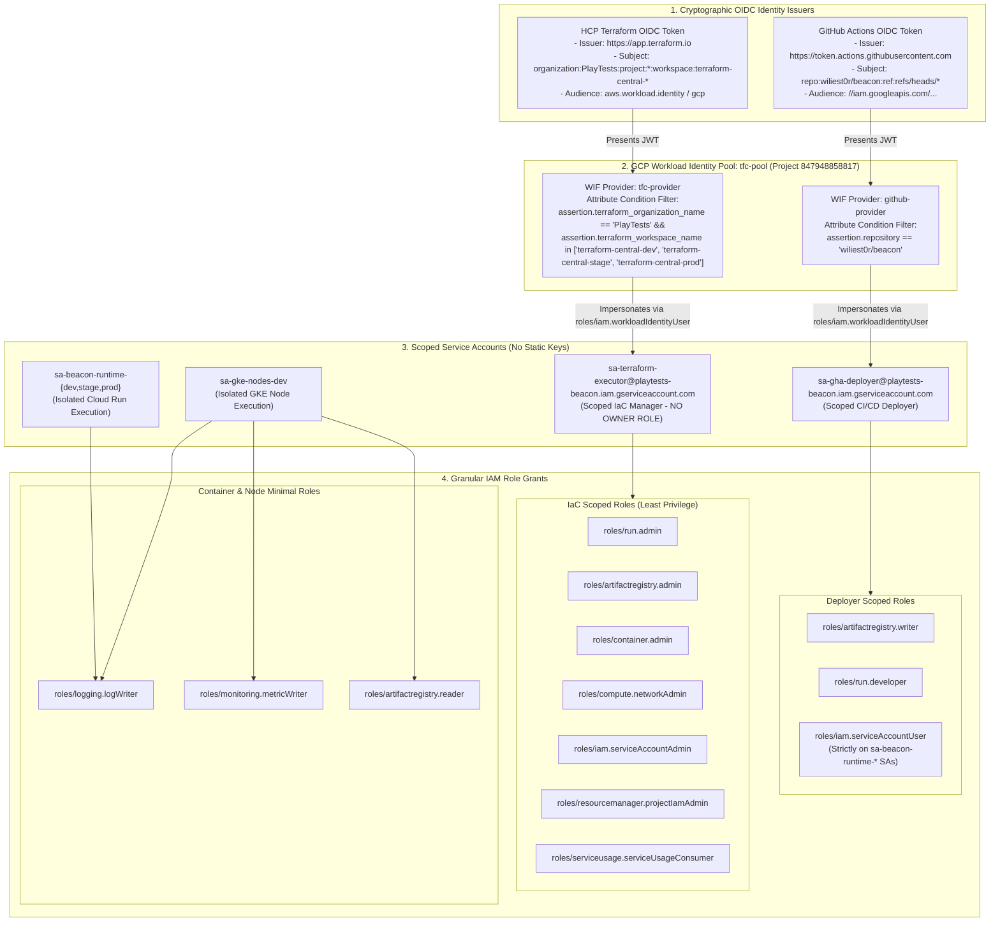

# Level 5: Zero-Trust Security, IAM & Workload Identity Federation (WIF)

This document specifies the identity and access management architecture governing **Google Cloud Platform (`playtests-beacon`)**, **HCP Terraform (`PlayTests`)**, and **GitHub Actions (`wiliest0r`)**.

---

## 1. Zero-Trust OIDC Federation & IAM Boundaries



---

## 2. Workload Identity Federation (WIF) Claim Matrix

### HCP Terraform Federation (`tfc-provider`)
* **Issuer**: `https://app.terraform.io`
* **Audience**: `projects/847948858817/locations/global/workloadIdentityPools/tfc-pool/providers/tfc-provider`
* **IAM Binding on `sa-terraform-executor`**:
  ```
  principalSet://iam.googleapis.com/projects/847948858817/locations/global/workloadIdentityPools/tfc-pool/attribute.terraform_workspace_name/terraform-central-dev
  principalSet://iam.googleapis.com/projects/847948858817/locations/global/workloadIdentityPools/tfc-pool/attribute.terraform_workspace_name/terraform-central-stage
  principalSet://iam.googleapis.com/projects/847948858817/locations/global/workloadIdentityPools/tfc-pool/attribute.terraform_workspace_name/terraform-central-prod
  ```
  *Result*: Any attempt to authenticate from unauthorized workspaces or other HCP Terraform organizations is rejected at the GCP identity boundary.

### GitHub Actions Federation (`github-provider`)
* **Issuer**: `https://token.actions.githubusercontent.com`
* **Attribute Mapping**:
  * `google.subject` = `assertion.sub`
  * `attribute.repository` = `assertion.repository`
  * `attribute.repository_owner` = `assertion.repository_owner`
  * `attribute.ref` = `assertion.ref`
  * `attribute.environment` = `assertion.environment`
* **IAM Binding on `sa-gha-deployer`**:
  ```
  principalSet://iam.googleapis.com/projects/847948858817/locations/global/workloadIdentityPools/tfc-pool/attribute.repository/wiliest0r/beacon
  ```
  *Result*: Only workflows originating from `wiliest0r/beacon` can request credentials to push images and trigger Cloud Run deployments.

---

## 3. Principle of Least Privilege (PoLP) IAM Summary

| Role | Target Identity | Justification |
| :--- | :--- | :--- |
| `roles/run.admin` | `sa-terraform-executor` | Create, configure, and manage Cloud Run services |
| `roles/container.admin` | `sa-terraform-executor` | Provision and configure GKE Standard clusters and node pools |
| `roles/compute.networkAdmin` | `sa-terraform-executor` | Provision dedicated VPC, subnets, and secondary IP ranges |
| `roles/artifactregistry.admin` | `sa-terraform-executor` | Provision Artifact Registry repositories and enforce tag immutability |
| `roles/iam.serviceAccountAdmin` | `sa-terraform-executor` | Create dedicated runtime and node service accounts |
| `roles/resourcemanager.projectIamAdmin` | `sa-terraform-executor` | Bind minimal IAM roles to provisioned service accounts |
| `roles/artifactregistry.writer` | `sa-gha-deployer` | Push compiled container / WASM OCI images from CI/CD |
| `roles/run.developer` | `sa-gha-deployer` | Update Cloud Run container image references to newly pushed tags |
| `roles/iam.serviceAccountUser` | `sa-gha-deployer` (Resource-scoped) | Impersonate `sa-beacon-runtime-*` during Cloud Run revision deployment |
| `roles/logging.logWriter` | `sa-beacon-runtime-*` | Write structured application stdout telemetry to Google Cloud Logging |
| `roles/logging.logWriter` + `monitoring.metricWriter` | `sa-gke-nodes-dev` | Export node diagnostics and metrics to Cloud Operations |
