# Level 6: GitOps, CI/CD DevSecOps Promotion Pipelines

This document specifies the GitOps branching model, automated DevSecOps verification gates, and progressive promotion pipeline across all environments.

---

## 1. End-to-End Promotion & DevSecOps Flowchart

```mermaid
flowchart TD
    %% =========================================================================
    %% DEVELOPER WORKFLOW
    %% =========================================================================
    subgraph DevBranching["1. Developer Feature Workflow"]
        DevLocal["Local Development\n(Feature / Fix Branch: feat/*)"]
        OpenPR["Open GitHub Pull Request\n(Targeting: develop)"]
        DevLocal -->|git push| OpenPR
    end

    %% =========================================================================
    %% DEVSECOPS VERIFICATION GATES
    %% =========================================================================
    subgraph SecGates["2. Automated DevSecOps Gates (Reusable Workflows)"]
        GateSecret["Gitleaks Secret Scan\n(Detect exposed tokens, private keys, API secrets)"]
        GateCVE["Trivy Vulnerability Scan\n(Scan dependencies & filesystem for HIGH/CRITICAL CVEs)"]
        GateLint["Lint & Format Verification\n(cargo clippy, eslint, rustfmt)"]
        GateBuild["Compile & Test Suite\n(cargo wasi build, wasm-opt, size budget check)"]

        OpenPR --> GateSecret --> GateCVE --> GateLint --> GateBuild
    end

    %% =========================================================================
    %% BRANCH PROTECTION
    %% =========================================================================
    subgraph BranchRules["3. Branch Protection Enforcement"]
        RuleCheck{"Branch Rules Passed?\n- Status checks green\n- Code review approved\n- No force push / No direct push"}
        GateBuild --> RuleCheck
    end

    %% =========================================================================
    %% DEV ENVIRONMENT
    %% =========================================================================
    subgraph EnvDev["4. Development Tier (develop branch)"]
        MergeDev["Merge PR into develop"]
        DeployDev["Deploy to Dev Tier:\n- HCP Terraform: terraform-central-dev\n- Cloud Run: beacon-server-dev\n- GKE: beacon-gke-dev\n- GAR: beacon-repo-dev"]
        RuleCheck -->|Pass| MergeDev --> DeployDev
    end

    %% =========================================================================
    %% STAGE ENVIRONMENT
    %% =========================================================================
    subgraph EnvStage["5. Staging Tier (stage branch)"]
        PromoteStage["Promote develop to stage\n(Fast-Forward / Release PR)"]
        DeployStage["Deploy to Staging Tier:\n- HCP Terraform: terraform-central-stage\n- Cloud Run: beacon-server-stage\n- GAR: beacon-repo-stage (Immutable Tags)"]
        DeployDev -->|QA & Integration Verified| PromoteStage --> DeployStage
    end

    %% =========================================================================
    %% PROD ENVIRONMENT WITH APPROVAL GATE
    %% =========================================================================
    subgraph EnvProd["6. Production Tier (main branch)"]
        PromoteProd["Promote stage to main\n(Release Tag v*.*.*)"]
        ProdEnvGate{"GitHub Environment: prod\nRequired Reviewer Gate\nApprover: wiliest0r"}
        DeployProd["Deploy to Production Tier:\n- HCP Terraform: terraform-central-prod\n- Cloud Run: beacon-server-prod (Min 1, 1Gi RAM)\n- GAR: beacon-repo-prod (Immutable Tags)\n- Deletion Protection: Active"]

        DeployStage -->|Release Ready| PromoteProd --> ProdEnvGate
        ProdEnvGate -->|Approved by wiliest0r| DeployProd
        ProdEnvGate -->|Rejected| Abort["Deployment Cancelled"]
    end
```

---

## 2. DevSecOps Reusable Workflows Architecture

Security checks are managed centrally in [`wiliest0r/gh-actions-central`](https://github.com/wiliest0r/gh-actions-central) and invoked as prerequisites before any artifact compilation or infrastructure mutation:

### 1. Gitleaks Secret Scanning
* **Trigger**: Every pull request and branch push.
* **Scan Scope**: Commits, git log history, and modified files.
* **Rule**: Blocks the pipeline if high-entropy strings, GCP service keys, private keys, or API tokens are detected.

### 2. Trivy Dependency & Filesystem Scanning
* **Trigger**: Pre-compilation step in CI.
* **Scan Scope**: Rust `Cargo.lock`, npm `package-lock.json`, and container base images.
* **Severity Filter**: Fails on unpatched `CRITICAL` or `HIGH` vulnerabilities.

---

## 3. GitHub Environments & Branch Governance Matrix

| Environment | Bound Branch | Protection Policy | Required Reviewers | Secret / WIF Scope |
| :--- | :--- | :--- | :--- | :--- |
| **`dev`** | `develop` | Branch Protection (PR required, no force-push) | Automated CI checks | Scoped to dev workspace & resources |
| **`stage`** | `stage` | Branch Protection (PR required, no force-push) | Automated CI checks | Scoped to stage workspace & resources |
| **`prod`** | `main` | Strict Branch Protection + Deletion Protection | **`wiliest0r` (Manual Sign-off)** | Scoped to production workspace & resources |
