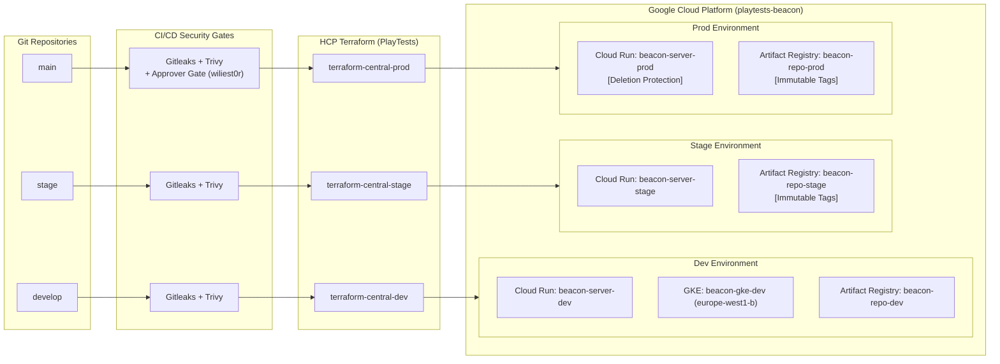

# Project Documentation & Architecture Blueprint
**Project**: Web Analytics & High-Performance Event Tracking Engine (POC)  
**Organization**: PlayTests  
**Methodology**: Spec-Driven Development (SSD) & Zero-Trust GitOps  
**GCP Project**: `playtests-beacon` (`847948858817`) | **Region**: `europe-west1`  
**Owner**: [wiliest0r](https://github.com/wiliest0r)

---

## 1. Documentation Index & Stack Hierarchy

This repository contains architectural specifications, flowcharts, security topologies, and deployment configurations across all layers of the stack:

| Level | Document | Description | Key Technologies |
| :---: | :--- | :--- | :--- |
| **0** | [**00-system-architecture.md**](file:///D:/repo/docs/00-system-architecture.md) | **Master System Architecture** | End-to-End topology connecting Client, Edge, GKE, Cloud Run & CI/CD |
| **1** | [**01-client-telemetry.md**](file:///D:/repo/docs/01-client-telemetry.md) | **Client Telemetry Edge Layer** | `< 5 KB` JS Tag, SPA route detection, CWV, CMP consent buffering |
| **2** | [**02-backend-engine.md**](file:///D:/repo/docs/02-backend-engine.md) | **WASM Processing Engine** | Spin WASM / WASI, token injection, `/v1/sync` ingestion & validation |
| **3** | [**03-edge-k8s-runtime.md**](file:///D:/repo/docs/03-edge-k8s-runtime.md) | **Edge & K8s Runtime Layer** | WSL2 k3s (`containerd-shim-spin`) vs GCP GKE Standard cluster |
| **4** | [**04-cloud-serverless.md**](file:///D:/repo/docs/04-cloud-serverless.md) | **Cloud Serverless & Registry** | Cloud Run v2, Artifact Registry, tag immutability & multi-env isolation |
| **5** | [**05-zero-trust-iam-wif.md**](file:///D:/repo/docs/05-zero-trust-iam-wif.md) | **Zero-Trust IAM & OIDC WIF** | Workload Identity Federation (`tfc-pool`), least-privilege IAM matrix |
| **6** | [**06-gitops-ci-cd-pipelines.md**](file:///D:/repo/docs/06-gitops-ci-cd-pipelines.md) | **GitOps & DevSecOps Pipelines** | Gitleaks, Trivy, HCP Terraform Cloud runs, GitHub Environments |

---

## 2. Multi-Environment & Branch Topology

---

## 3. Repositories Ecosystem

| Repository | Scope | URL |
| :--- | :--- | :--- |
| **`wiliest0r/web-tag`** | Ultra-lightweight client-side telemetry JavaScript tag | https://github.com/wiliest0r/web-tag |
| **`wiliest0r/beacon`** | Rust WASM/WASI HTTP backend for event ingestion & tag delivery | https://github.com/wiliest0r/beacon |
| **`wiliest0r/deploy`** | K8s WASM manifests, k3s setup scripts & local edge deployment | https://github.com/wiliest0r/deploy |
| **`wiliest0r/gh-actions-central`** | Central reusable CI/CD workflows, DevSecOps gates & OCI actions | https://github.com/wiliest0r/gh-actions-central |
| **`wiliest0r/terraform-central`** | HCP Terraform IaC managing isolated GCP environments & GKE | https://github.com/wiliest0r/terraform-central |
| **`wiliest0r/docs`** | Project documentation, flowcharts & architectural specifications | https://github.com/wiliest0r/docs |

---

## 4. Resource Taxonomy & Labeling Standard

Every managed resource across GCP and Kubernetes adheres strictly to this taxonomy:

| Label Key | Allowed Values / Format | Description |
| :--- | :--- | :--- |
| `organization` | `playtests` | Parent enterprise organization |
| `project` | `beacon-analytics` | Business project initiative |
| `managed_by` | `terraform` | Automation provisioning engine |
| `repository` | `terraform-central` / `beacon` / `web-tag` | Source repository responsible for resource |
| `component` | `beacon-server` / `beacon-tag` / `gke-node` | Functional sub-system component |
| `environment` | `dev` / `stage` / `prod` | Deployment environment tier |
| `app_version` | e.g. `0-1-0` (sanitized semver) | Deployed application release version |
| `git_sha` | e.g. `2ef5256` | Git commit hash generating the release |
