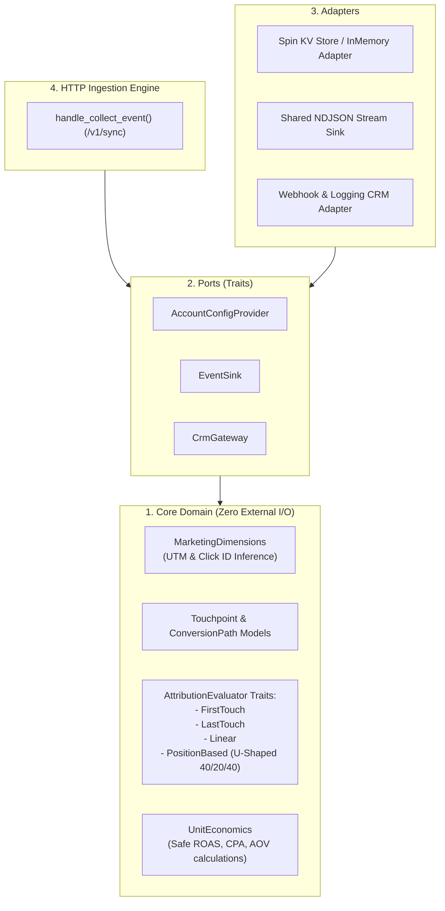

# Why We Ditched Node.js for Rust WASM: Building a Sub-Millisecond Event Ingestion Engine Under 5MB

*By the Engineering Team at PlayTests*


---

## The Latency Paradox in Modern AdTech & Telemetry

In high-velocity advertising technology and event analytics, **latency is revenue**. 

When an end-user clicks a Facebook ad (`fbclid`) or a Google ad (`gclid`), lands on an e-commerce store, and submits a lead or checkout form, a complex ingestion pipeline triggers in the background. The ingestion pixel must:
1. Validate HMAC security tokens to prevent fraudulent event injection.
2. Resolve multi-tenant accounts (`account_id`) and physical hardware devices (`device_id`).
3. Parse UTM parameters and deep AdTech click IDs.
4. Normalize and buffer the event without blocking the user interface.

For years, the industry standard has been to write these ingestion endpoints in **Node.js (Express/Fastify)** or **Python (FastAPI)** packaged into standard Linux Docker containers.

And for years, engineering teams have lived with the painful consequences:
* **Memory Bloat:** A single Node.js container with minimal dependencies easily idles at 150–250 MB of RAM, ballooning past 500 MB under moderate load.
* **Garbage Collection (GC) Spikes:** When thousands of JSON payloads hit the V8 engine simultaneously, GC pause times cause unpredictable p99 latency spikes (jumping from 5 ms to 250+ ms).
* **Cold Starts:** In autoscaling container groups, booting a 200 MB container image takes anywhere from 8 to 25 seconds. During sudden advertising bursts (e.g., an email blast or flash sale), this delay leads to 504 Gateway Timeouts and dropped attribution data.

We decided there had to be a better way. We rebuilt our core telemetry ingestion engine from the ground up using **Rust and WebAssembly (WASM)** powered by the **Fermyon Spin framework**.

The results blew our expectations out of the water:
* **Binary Size:** Under **5 MB** compiled release artifact.
* **Startup Time:** Under **1 millisecond** (WASI component instantiation).
* **Memory Footprint:** Less than **15 MB** RSS per instance.
* **Edge Processing Latency:** **0.5 – 1.8 milliseconds** p95 response time.

Here is how we architected the system.

---

## 1. Why WebAssembly on the Server?

WebAssembly isn't just for running Doom in the browser anymore. Through the **WebAssembly System Interface (WASI)** and the **WebAssembly Component Model**, WASM has evolved into the ultimate server-side runtime:

```mermaid
flowchart LR
    subgraph Traditional ["Traditional Container Model"]
        LinuxKernel["Linux Kernel"] --> ContainerOS["Container OS (Debian/Alpine ~50-100MB)"]
        ContainerOS --> NodeRuntime["Node.js / Python VM (~80MB)"]
        NodeRuntime --> AppCode["Application Logic (200MB+ RAM)"]
    end

    subgraph WasmModel ["WebAssembly Component Model (Spin)"]
        HostOS["Host OS / K8s Node"] --> WasmHost["Wasmtime / Spin Host Runtime"]
        WasmHost --> WasmModule["Sandboxed WASM Module (<5MB Bin, <15MB RAM)"]
    end
```



### The Three Superpowers of Server-Side WASM:
1. **Zero Cold Starts:** Because a WASM module does not bundle an entire operating system or a heavy virtual machine, the WASM runtime (`wasmtime`) instantiates the module in microseconds.
2. **Capability-Based Sandboxing:** By default, a WASM module cannot access the filesystem, the network, or system clocks unless explicitly granted capability permissions in the application manifest (`spin.toml`). This provides zero-trust security out of the box.
3. **Density and Cost:** On a modest GKE node (e.g., `e2-small` with 2 GB RAM), you can run dozens of concurrent WASM workloads where traditional Docker containers would exhaust memory before touching 20% CPU utilization.

---

## 2. Segmented Clean Architecture in Rust

High-performance code often turns into an unmaintainable "spaghetti" of micro-optimizations. To prevent this, we structured the Rust backend using **Clean / Hexagonal Architecture**, isolating our domain algorithms from network protocols and storage engines:



### Core Attribution Engine: Pure, Testable Domain Logic
Our attribution evaluators (First-Touch, Last-Touch, Linear, and Position-Based U-Shaped) are pure Rust functions operating strictly on domain values:

```rust
pub trait AttributionEvaluator: Send + Sync {
    fn name(&self) -> &'static str;
    fn evaluate(&self, path: &ConversionPath) -> Vec<AttributedTouchpoint>;
}

pub struct PositionBasedAttributor; // 40% First, 40% Last, 20% Middle

impl AttributionEvaluator for PositionBasedAttributor {
    fn name(&self) -> &'static str {
        "position_based_u_shaped"
    }

    fn evaluate(&self, path: &ConversionPath) -> Vec<AttributedTouchpoint> {
        let count = path.touchpoints.len();
        if count == 0 { return vec![]; }
        if count == 1 {
            return vec![AttributedTouchpoint::new(path.touchpoints[0].clone(), 1.0, path.conversion.value)];
        }

        let mut results = Vec::with_capacity(count);
        let first_weight = 0.40;
        let last_weight = 0.40;
        let middle_weight = if count > 2 { 0.20 / (count - 2) as f64 } else { 0.0 };

        for (i, touchpoint) in path.touchpoints.iter().enumerate() {
            let weight = if i == 0 {
                first_weight
            } else if i == count - 1 {
                last_weight
            } else {
                middle_weight
            };
            results.push(AttributedTouchpoint::new(touchpoint.clone(), weight, path.conversion.value * weight));
        }
        results
    }
}
```

Because this core domain code has **zero dependencies on HTTP frameworks or database drivers**, we execute comprehensive unit test suites in **under 2 milliseconds**.

---

## 3. The Client-Side Dilemma: Privacy, ITP, and `fp.js`

An ingestion engine is only as good as the client data it receives. With Safari's Intelligent Tracking Prevention (ITP), Firefox Enhanced Tracking Protection (ETP), and Chrome phasing out 3rd-party cookies, client identity is fragile:
* Safari caps `document.cookie` and `localStorage` to **7 days** (or **24 hours** for visits containing query click IDs like `fbclid`).
* Users clearing cookies or switching between private browsing sessions trigger new anonymous IDs, fragmenting the attribution path.

### The Solution: Zero-Dependency Hybrid Fingerprinting (`fp.js`)
Instead of importing heavy commercial fingerprinting packages (which easily add 15–20 KB gzipped), we engineered a native, zero-dependency browser fingerprint module (`fp.js`) adhering to a strict **< 5.0 KB gzip budget**:

```javascript
// Lightweight 64-bit FNV-1a Hash for high entropy
function fnv1a64(str) {
  let h1 = 0x811c9dc5, h2 = 0x811c9dc5;
  for (let i = 0; i < str.length; i++) {
    const ch = str.charCodeAt(i);
    h1 = Math.imul(h1 ^ ch, 0x01000193);
    h2 = Math.imul(h2 ^ (ch >> 8), 0x01000193);
  }
  return (h1 >>> 0).toString(16).padStart(8, '0') + (h2 >>> 0).toString(16).padStart(8, '0');
}
```

### Entropy Sources Collected:
1. **Canvas 2D Geometry & Fonts:** Offscreen sub-pixel rendering of complex curves, emojis, and gradient blending (revealing GPU rasterization and font hinting differences).
2. **Physical Display Geometry:** `screen.width`, `screen.height`, `screen.colorDepth`, and `devicePixelRatio`.
3. **Hardware Profile:** `navigator.hardwareConcurrency` (CPU cores), `navigator.deviceMemory` (RAM).
4. **Time & Locale:** `Intl.DateTimeFormat` timezone, UTC offset, and preferred system languages.
5. **Bot Detection:** `navigator.webdriver` to instantly tag automated Selenium, Puppeteer, and Playwright bots.

The entire compiled web tag bundle with `fp.js`, consent management, and auto-tracking measures just **3.75 KB gzipped**.

---

## 4. Ingestion Normalization & The Device-Centric Contract

When telemetry hits our Rust WASM edge endpoint at `/v1/sync`, the payload is standardized to an industry-standard device contract:

```json
{
  "app_id": "playtests-store",
  "device_id": "c7a8b9d0-1234-4567-89ab-cdef01234567",
  "device_fp": "a9f4c3b218e76543",
  "session_id": "e4f5a6b7-8901-2345-6789-0123456789ab",
  "event_name": "lead_submission",
  "client_timestamp": "2026-09-20T17:45:00.000Z",
  "marketing": {
    "gclid": "Cj0KCQjwmOm3Bh...",
    "utm_source": "google",
    "utm_medium": "cpc",
    "utm_campaign": "fall_launch"
  }
}
```

The WASM engine enforces:
1. **HMAC Handshake Validation:** Every tenant receives an ephemeral HMAC token generated upon loading `tag.js`. Events with expired or forged tokens are automatically flagged as `is_quarantined = true` with full audit reasons.
2. **Identity Fallback Chain:** If `device_id` is missing or cleared, the engine falls back to `device_fp` for cross-session attribution joining in BigQuery.
3. **Zero Allocations in Critical Path:** JSON parsing uses `serde_json` directly into stack-allocated models, passing zero-copy string references where possible.

---

## 5. Local Development Experience: `spin up` in 50ms

One of the greatest joys of developing with Rust and Spin is the developer loop. There is no need to wait 2 minutes for Docker daemon builds:

```bash
# Build the WASM binary
cargo build --target wasm32-wasip1 --release

# Run locally in microsecond runtime
spin up
# Logging: Available on http://127.0.0.1:3000
```

With `spin up`, the local server boots in **45 milliseconds**. You can immediately pipe 1,000 synthetic requests with `autocannon` or `wrk` and watch the CPU usage barely register on your system monitor.

---

## What's Next in Part 2?

Having a lightning-fast local WASM binary is great, but how do you run it reliably in production?
* How do you package WebAssembly inside Kubernetes without running heavy containers?
* Why is streaming directly to cloud queues an anti-pattern, and how does the **Vector Sidecar Pattern** save the day?
* How do we ensure zero event loss even during cloud provider outages?

👉 **Stay tuned for Part 2:** *«Running WebAssembly Workloads in Production Kubernetes: The Ultimate Lightweight Sidecar Pattern»*.

---
*Code examples and architecture blueprints from this series are open-sourced in our [GitHub Repositories](https://github.com/wiliest0r).*