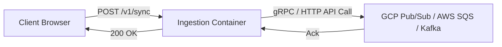

# Running WebAssembly Workloads in Production Kubernetes: The Ultimate Lightweight Sidecar Pattern

*By the Engineering Team at PlayTests*


---

In [Part 1 of our series](part-1-why-we-ditched-nodejs-for-rust-wasm.md), we detailed why we replaced our Node.js ingestion endpoints with a Rust WebAssembly (WASM) engine built on the Fermyon Spin framework. We achieved sub-millisecond response times with a compiled binary under 5 MB.

Now comes the million-dollar operational question:

> **"How do you actually deploy and operate WebAssembly workloads inside a production Kubernetes cluster without adding operational complexity?"**

In this post, we share our production Kubernetes architecture on Google Kubernetes Engine (GKE), how we solved the network egress bottleneck using the **Vector Sidecar Pattern**, and how we guarantee **zero event loss** even during cloud provider outages.

---

## 1. The Trap of Synchronous Cloud Queue Publishing

When building an event ingestion API, the instinctive architecture looks like this:



### Why this is a fatal anti-pattern in production:
1. **Network Egress Latency:** Making an external HTTPS/gRPC call from your request handler introduces 15–80 ms of latency per event. Your high-performance Rust WASM edge engine (which executes in 0.8 ms) spends 98% of its time waiting on remote network I/O.
2. **Cascading Failures:** If Google Cloud Pub/Sub or AWS SQS experiences a momentary latency spike or rate limit (HTTP 429), your application's connection pool saturates. Incoming HTTP connections queue up, memory fills up, and your pods crash with Out-Of-Memory (OOM) or timeout errors.
3. **Event Loss:** If a pod crashes mid-request while waiting on the cloud queue, that client event is permanently lost.

---

## 2. The Solution: Pod-Level Vector Sidecar with Shared Memory

To decouple edge request ingestion from cloud transmission, we implemented the **Sidecar Pattern** using [Vector](https://vector.dev/)—an enterprise-grade, blazingly fast observability and data pipeline agent written in Rust:

```mermaid
flowchart TD
    subgraph K8sPod ["Kubernetes Pod (beacon-server)"]
        subgraph AppContainer ["Container 1: Spin WASM Edge"]
            WASM["beacon-server (:3000)<br/>- CPU Request: 50m<br/>- RAM: ~15MB"]
        end

        subgraph SharedDisk ["Shared Pod Volume (emptyDir)"]
            PipeFile["/var/log/beacon/events.ndjson<br/>(Local Append-Only Stream)"]
        end

        subgraph VectorContainer ["Container 2: Vector Sidecar"]
            Vector["Vector Agent 0.43.0<br/>- Inotify File Tailer<br/>- On-Disk Buffer: 512MB<br/>- Prometheus Exporter :9090"]
        end

        WASM -->|Blazing Fast File Append (<0.1ms)| PipeFile
        PipeFile -->|Inotify Tail & Parse| Vector
    end

    subgraph GCPCloud ["Google Cloud Platform"]
        PubSub["Pub/Sub Topic: beacon-events<br/>Ordering Key: account_id"]
        DLQ["Dead Letter Queue Topic<br/>(Max Delivery Attempts: 5)"]
        PubSub -.->|5 Failed Retries| DLQ
    end

    Vector -->|Batched gRPC Streaming| PubSub
```

### How the Flow Works:
1. **Instant Client Response:** The client sends an event to `/v1/sync`. The Spin WASM container validates HMAC, normalizes `device_id`, writes a single line of NDJSON to the shared `emptyDir` volume, and returns `204 No Content` to the browser in **< 1.5 ms**.
2. **Inotify Tail & Batch:** Vector tails the shared file using Linux `inotify`. It parses the JSON, validates schema fields, and batches records in memory.
3. **Resilient On-Disk Buffering:** If Google Cloud Pub/Sub is unreachable, Vector automatically spills events to its dedicated 512 MB on-disk buffer. Once connectivity resumes, Vector drains the buffer at wire speed without dropping a single event.

---

## 3. The Kubernetes Pod Manifest in Terraform

We manage our entire Kubernetes workload through Infrastructure-as-Code (Terraform) via HCP Terraform. Here is the actual production configuration of our dual-container pod:

```hcl
resource "kubernetes_deployment_v1" "beacon_server" {
  metadata {
    name      = "beacon-server"
    namespace = kubernetes_namespace_v1.beacon.metadata[0].name
  }

  spec {
    replicas = 1 # Dynamically managed by HPA v2

    selector {
      match_labels = {
        app = "beacon-server"
      }
    }

    template {
      metadata {
        labels = {
          app = "beacon-server"
        }
      }

      spec {
        # Shared volume between WASM and Vector
        volume {
          name = "event-pipe"
          empty_dir {
            medium     = "" # Standard pod disk
            size_limit = "1Gi"
          }
        }

        # Container 1: Spin WASM Edge Server
        container {
          name  = "beacon-server"
          image = "europe-west1-docker.pkg.dev/${var.project_id}/beacon-containers/beacon-server:latest"

          port {
            container_port = 3000
          }

          resources {
            requests = {
              cpu    = "50m"
              memory = "64Mi"
            }
            limits = {
              cpu    = "500m"
              memory = "256Mi"
            }
          }

          volume_mount {
            name       = "event-pipe"
            mount_path = "/var/log/beacon"
          }
        }

        # Container 2: Vector Sidecar Ingestion Agent
        container {
          name  = "vector-sidecar"
          image = "timberio/vector:0.43.0-alpine"

          port {
            container_port = 9090
            name           = "metrics"
          }

          resources {
            requests = {
              cpu    = "20m"
              memory = "32Mi"
            }
            limits = {
              cpu    = "200m"
              memory = "128Mi"
            }
          }

          volume_mount {
            name       = "event-pipe"
            mount_path = "/var/log/beacon"
            read_only  = true
          }
        }
      }
    }
  }

  lifecycle {
    ignore_changes = [
      spec[0].replicas # Crucial: allows HPA v2 to manage replicas without Terraform conflicts
    ]
  }
}
```

Notice the resource requests:
* **Spin WASM:** 50m CPU, 64Mi RAM.
* **Vector Sidecar:** 20m CPU, 32Mi RAM.

The total pod request is only **70m CPU and 96Mi RAM**! You can easily fit 20 of these pods on a single low-cost virtual machine.

---

## 4. Multi-Tenant Sharding: Why `ordering_key = account_id` Matters

In advertising analytics, event order is sacred. If an end-user clicks an ad, browses three pages, and buys a product, the attribution engine must process those events in exact chronological sequence.

In high-throughput distributed message brokers (like Pub/Sub or Kafka), global event ordering is impossible without choking throughput.

Our Vector configuration solves this using **Pub/Sub Ordering Keys**:

```toml
# vector.toml configuration snippet
[sources.beacon_events_file]
type = "file"
include = ["/var/log/beacon/events.ndjson"]
read_from = "beginning"

[sinks.pubsub_events]
type = "gcp_pubsub"
inputs = ["beacon_events_file"]
project = "${GCP_PROJECT}"
topic = "beacon-events"
ordering_key = "{{ account_id }}" # Shards traffic per client account

[sinks.pubsub_events.buffer]
type = "disk"
max_size = 536870912 # 512 MB safety buffer
```

By specifying `ordering_key = "{{ account_id }}"`, Google Cloud Pub/Sub guarantees strict FIFO delivery within each customer account, while scaling horizontally across thousands of accounts without contention.

---

## 5. The Safety Net: Dead Letter Queues (DLQ)

What happens if an upstream consumer crashes, or a malformed message cannot be processed?

Instead of retrying forever and causing head-of-line blocking in the ingestion pipeline, we configured an automatic Dead Letter Queue (DLQ) policy in Terraform:

```hcl
resource "google_pubsub_subscription" "beacon_events_sub" {
  name  = "beacon-events-sub"
  topic = google_pubsub_topic.beacon_events.id

  # Dead Letter Policy
  dead_letter_policy {
    dead_letter_topic     = google_pubsub_topic.beacon_events_dlq.id
    max_delivery_attempts = 5
  }

  ack_deadline_seconds = 20
}
```

If a message fails delivery 5 times, Pub/Sub automatically diverts it to `beacon-events-dlq`. 

We attached an automated Google Cloud Monitoring Alert to this subscription: if any message enters the DLQ, an engineer is alerted immediately via PagerDuty/Slack, allowing zero silent data corruption.

---

## Summary: A Bulletproof Edge Architecture

By combining **Rust WASM** with the **Vector Sidecar Pattern**, we achieved:
* **Microsecond Edge Response:** Local disk append eliminates external network blocking.
* **Guaranteed Delivery:** 512 MB on-disk buffer handles transient cloud outages gracefully.
* **Minimal Footprint:** The entire dual-container pod runs comfortably in ~54 MB of active memory.

Now that our pods are rock-solid, how do we handle traffic that surges from 1 RPS at midnight to 1,000+ RPS during a Black Friday flash sale without breaking the bank?

👉 **Stay tuned for Part 3:** *«Handling 1,000+ RPS for $30/Month: Elastic Kubernetes Autoscaling with Spot VMs and Rust WASM»*.

---
*Follow our engineering blog for more deep dives into WebAssembly, Kubernetes, and Cloud Architecture.*