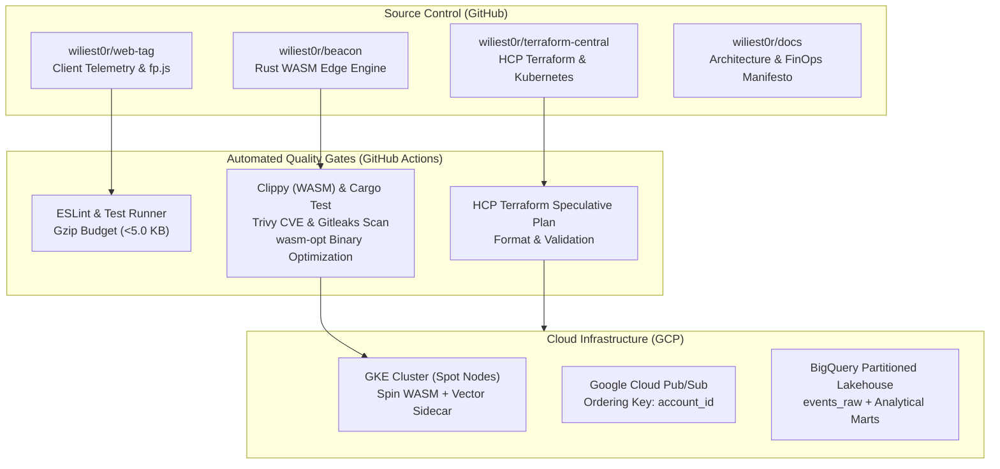
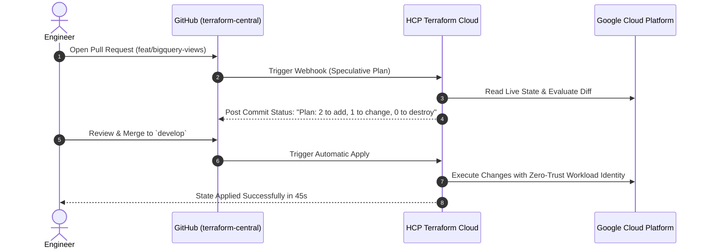

# Zero-Click GitOps: How We Ship Infrastructure, WASM, and BigQuery Data Marts via HCP Terraform and GitHub Actions

*By the Engineering Team at PlayTests*


---

Over the course of this four-part series, we have explored:
1. [Why we replaced Node.js with Rust WebAssembly (WASM) for sub-millisecond event ingestion](part-1-why-we-ditched-nodejs-for-rust-wasm.md).
2. [How the Vector Sidecar Pattern in Kubernetes guarantees zero event loss with a 50MB RAM footprint](part-2-wasm-in-kubernetes-sidecar.md).
3. [How HPA v2 and Spot VMs scale from 1 to 1,000+ RPS for less than $35/month](part-3-elastic-autoscaling-finops.md).

In this concluding installment, we tie the entire ecosystem together into a cohesive, production-grade delivery mechanism:

> **"How do you ship code, update infrastructure, and evolve BigQuery analytical schemas with zero manual clicks in the cloud console, zero risk of breaking production, and strict security compliance?"**

Here is our blueprint for **Zero-Click GitOps**.

---

## 1. The Multi-Repo GitOps Architecture

Rather than forcing our frontend SDK, backend engine, and cloud infrastructure into a monolithic repository, we separated concerns across four specialized repositories, each with dedicated CI/CD gates:



### Why Multi-Repo Works Better for GitOps:
* **Separation of Blast Radii:** An update to the client-side `fp.js` tracking tag should never trigger an infrastructure redeployment in Kubernetes.
* **Granular Least-Privilege Permissions:** Frontend engineers do not need write access to Terraform state or IAM roles.
* **Targeted Quality Gates:** Each repository runs specialized security gates tuned to its language ecosystem.

---

## 2. Hardened Quality & Security Gates in GitHub Actions

Every pull request must pass strict, non-negotiable security and linting checks before any code can be merged into `develop` or `main`.

### For the Rust WASM Backend (`wiliest0r/beacon`):
1. **Static Analysis & Linting:** `cargo clippy --target wasm32-wasip1 -- -D warnings` ensures zero compiler warnings or unsafe pointer dereferences.
2. **Deterministic Formatting:** `cargo fmt --check` enforces uniform code aesthetics.
3. **Secret Leak Prevention:** **Gitleaks** scans every commit diff to ensure developer API keys, Google Cloud service account keys, or tokens are never committed to version control.
4. **Filesystem & Dependency Vulnerability Scanning:** **Trivy** inspects all crates for known CVE vulnerabilities.
5. **WASM Optimization:** In the release pipeline, `wasm-opt -O3` strips unused debug symbols, shrinking the compiled binary down to **under 5 MB**.

### For the Client Tag (`wiliest0r/web-tag`):
1. **Bundle Size Enforcement:** Our `build.mjs` bundler script measures the gzipped size of `tag.js`. If the bundle exceeds **5.0 KB gzip**, the build fails automatically:
```javascript
// build.mjs enforcement snippet
const gzipSize = zlib.gzipSync(result.outputFiles[0].contents).length;
if (gzipSize > 5120) {
  console.error(`FATAL: Tag bundle size (${(gzipSize / 1024).toFixed(2)} KB) exceeds 5.0 KB limit!`);
  process.exit(1);
}
```

---

## 3. HCP Terraform & Speculative Plans: No More "Terraform Apply" Fear

One of the most anxiety-inducing tasks in engineering is running `terraform apply` on a shared production state from a developer's local laptop. A stale state file or an uncommunicated change can wipe out production databases in seconds.

To eliminate this, we integrated **HashiCorp HCP Terraform (Terraform Cloud)** with GitHub:



### Key Advantages:
1. **Zero Secret Leaks:** No engineer holds permanent GCP service account credentials on their local machine. HCP Terraform authenticates to Google Cloud via Workload Identity Federation (WIF).
2. **Pre-Merge Certainty:** Every pull request displays the exact speculative plan in the GitHub PR check list. If a planned change would inadvertently recreate a database table, it is caught *before* merging.
3. **Auditability:** Every infrastructure change is permanently tied to a Git commit hash, PR discussion, and author.

---

## 4. The BigQuery Lakehouse: Zero-ETL Real-Time Analytics

Once events are ingested by the Rust WASM edge and published to Google Cloud Pub/Sub, they land directly in **Google BigQuery** without requiring heavy, expensive Dataflow (Apache Beam) or Spark streaming jobs.

### BigQuery Ingestion Architecture:
* **Partitioned & Clustered Raw Table (`events_raw`):**
  * Partitioned by `DATE(server_timestamp)` (keeps storage queries cheap and blazing fast).
  * Clustered by `account_id`, `event_name`, and `device_id`.
* **AdTech Schema Evolution:**
  * When we migrated our identity layer from `visitor` to `device`, we added `device_id` and `device_fp` as `NULLABLE` fields in `schemas/events_schema.json`.
  * BigQuery accepts the schema evolution without table lockups or downtime.

---

## 5. Turning Raw Events into Actionable Marketing Marts

Raw data is useless without analytics. Using Terraform, we deployed three analytical SQL views directly on top of `events_raw`:

### 1. Active Devices View (`v_daily_active_users`)
Measures unique engaged devices across tenants, seamlessly bridging legacy `visitor_id` with new `device_id`:
```sql
SELECT
  account_id,
  DATE(server_timestamp) AS date,
  COUNT(DISTINCT COALESCE(device_id, visitor_id)) AS active_devices,
  COUNT(1) AS total_events
FROM `playtests-dev.beacon_analytics_dev.events_raw`
WHERE is_quarantined = FALSE
GROUP BY 1, 2
```

### 2. Multi-Touch Attribution Mart (`v_attribution_first_last_touch`)
Identifies customer journey touchpoints using BigQuery SQL windowing functions:
```sql
WITH touchpoints AS (
  SELECT
    account_id,
    COALESCE(device_id, visitor_id) AS device_id,
    event_id,
    server_timestamp,
    utm_source,
    utm_campaign,
    gclid,
    fbclid,
    FIRST_VALUE(utm_source IGNORE NULLS) OVER (
      PARTITION BY account_id, COALESCE(device_id, visitor_id)
      ORDER BY server_timestamp ASC
      ROWS BETWEEN UNBOUNDED PRECEDING AND CURRENT ROW
    ) AS first_touch_source,
    LAST_VALUE(utm_source IGNORE NULLS) OVER (
      PARTITION BY account_id, COALESCE(device_id, visitor_id)
      ORDER BY server_timestamp ASC
      ROWS BETWEEN UNBOUNDED PRECEDING AND UNBOUNDED FOLLOWING
    ) AS last_touch_source
  FROM `playtests-dev.beacon_analytics_dev.events_raw`
  WHERE is_quarantined = FALSE
)
SELECT * FROM touchpoints
```

### 3. Campaign Unit Economics Mart (`v_campaign_unit_economics`)
Calculates real-time Return on Ad Spend (ROAS), Cost Per Acquisition (CPA), and Average Order Value (AOV) dynamically:
```sql
SELECT
  account_id,
  utm_source,
  utm_campaign,
  COUNT(DISTINCT COALESCE(device_id, visitor_id)) AS unique_devices,
  COUNTIF(is_conversion = TRUE) AS conversions,
  ROUND(SAFE_DIVIDE(COUNTIF(is_conversion = TRUE), COUNT(DISTINCT COALESCE(device_id, visitor_id))) * 100, 2) AS conversion_rate_pct
FROM `playtests-dev.beacon_analytics_dev.events_raw`
WHERE is_quarantined = FALSE
GROUP BY 1, 2, 3
```

Marketers and data analysts query these views in Looker Studio or Google Sheets with sub-second response times, without burdening the live ingestion servers.

---

## 6. Key Takeaways from Our Journey

Building a production-grade, multi-tenant AdTech ingestion platform doesn't require a seven-figure cloud budget or a 20-person platform team:

1. **WASM on the Edge is Production-Ready:** Compiling Rust to `wasm32-wasip1` via Fermyon Spin delivers microsecond boot times, sub-millisecond request latencies, and consumes 90% less RAM than traditional Dockerized runtimes.
2. **Never Publish to Cloud Queues from Request Handlers:** The Vector Sidecar Pattern with an on-disk buffer eliminates remote I/O blocking and protects against cloud provider outages.
3. **Aggressive HPA + Spot VMs = Pure FinOps Gold:** Scaling up in 15 seconds without stabilization windows absorbs marketing traffic surges, while Spot instances keep the monthly GCP bill under $35.
4. **GitOps is Non-Negotiable:** With HCP Terraform speculative plans and automated GitHub security gates, engineers can ship features with confidence every single day.

---

## Open Source & Resources

All architectural diagrams, Terraform configurations, Rust WASM implementations, and client SDK code referenced in this series are openly documented in our repositories:

* [Architecture & FinOps Manifesto](https://github.com/wiliest0r/docs)
* [Rust WASM Beacon Server](https://github.com/wiliest0r/beacon)
* [Client Web Tag & fp.js](https://github.com/wiliest0r/web-tag)
* [Terraform Central Infrastructure](https://github.com/wiliest0r/terraform-central)

*Thank you for following along on this engineering journey. If you found this series valuable, give it a clap on Medium or a heart on Dev.to, and let us know your thoughts in the comments!*