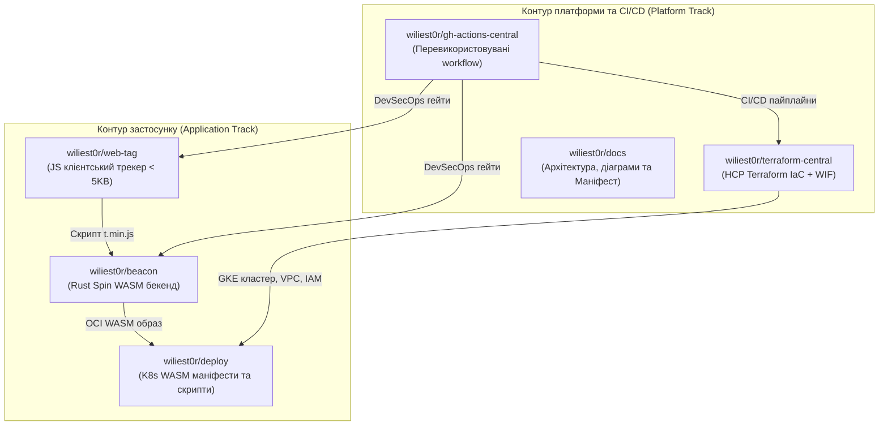
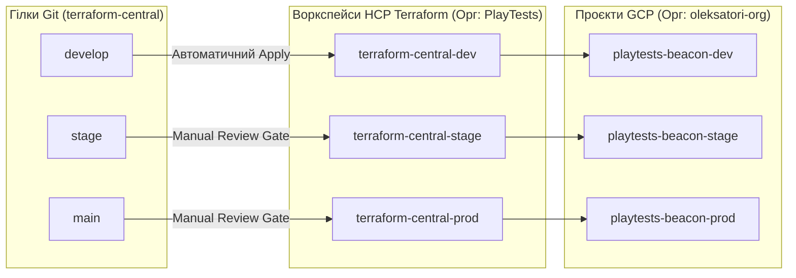
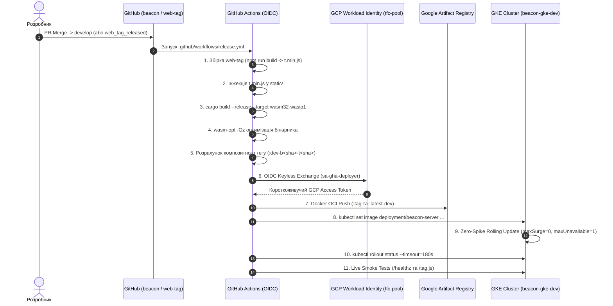

# МАНІФЕСТ: Beacon Analytics — Архітектура Хмарної Інфраструктури (GCP, HCP Terraform & Wasm-Spin GKE)

> **Статус:** Офіційний архітектурний маніфест (Active / Living Document)  
> **Призначення:** Єдине джерело істини (Single Source of Truth, SSOT) щодо цільової архітектури, принципів безпеки, інфраструктурного управління, дорожньої карти та стандартів експлуатації платформи аналітики **Beacon Analytics**.

---

## 1. Стратегічні цілі (Goals & Objectives)

### 1.1. Декларативне управління інфраструктурою (No ClickOps & GitOps)
* **Повна автоматизація (IaC через HCP Terraform):** Усі хмарні ресурси GCP створюються та керуються виключно через код у репозиторії [`wiliest0r/terraform-central`](https://github.com/wiliest0r/terraform-central). Жодних ручних модифікацій через консоль GCP («Zero ClickOps»).
* **Ізоляція радіуса ураження (Blast Radius Reduction):** Відмова від монолітного state-файлу. Чітке розділення на ізольовані оточення (`dev`, `stage`, `prod`) з окремими проєктами в GCP та незалежними воркспейсами в HCP Terraform (`PlayTests`).
* **Абсолютна безпарольність (Keyless Security / Zero Static Secrets):** Повна відмова від експорту статичних сервісних ключів у форматі JSON (`Service Account Keys`). Вся автентифікація (як для HCP Terraform, так і для GitHub Actions) базується виключно на **Workload Identity Federation (OIDC)** із короткоживучими токенами доступу.
* **Мінімізація витоку чутливих даних (Decoupled Configuration):** Усі параметри цільової хмари (Project ID, Region, Zone, WIF Providers) передаються виключно через змінні оточення воркспейсів HCP Terraform та Repository Variables у GitHub Actions. Конфігураційні файли репозиторію не містять жорстко зашитих реальних імен проєктів чи облікових даних.

### 1.2. Організаційна ієрархія та фабрика проєктів GCP
* **Організація:** Ресурси розміщуються в межах виділеної організації **`oleksatori-org`** (ID: `455342405415`).
* **Ізольовані проєкти за середовищами:**
  * **Dev:** `playtests-beacon-dev` (Project #: `739483964968`) — пісочниця та середовище швидкої розробки з авто-розгортанням.
  * **Stage:** `playtests-beacon-stage` — середовище передрелізного тестування з незмінними (immutable) OCI-тегами.
  * **Prod:** `playtests-beacon-prod` — продуктивне середовище із суворими approval-гейтами та захистом від видалення.
* **Централізований білінг:** Усі проєкти автоматично підключаються до Cloud Billing Account (`01AEB6-EF391A-41CC3C`) із вимкненням дефолтних небезпечних мереж (`auto_create_subnetworks = false`).

### 1.3. Високопродуктивний хмарний WebAssembly (Wasm-Spin) у Kubernetes
* **Портативний запуск WASM (Fermyon Spin OCI):** Застосування платформи **Fermyon Spin** у складі керованого кластера **Google Kubernetes Engine (GKE)**. Пакування скомпільованого бінарника (`wasm32-wasip1` + `wasm-opt -Oz`) поверх легкого базового образу `ghcr.io/fermyon/spin:v2.7.0` забезпечує 100% сумісність зі стандартними GKE пулами нод (COS) без необхідності модифікації ядра вузлів чи складних custom containerd shims.
* **Наднизький час холодного старту (< 5 мс):** Миттєва ініціалізація WASM-модулів у пам'яті під навантаженням замість секундного прогріву важких контейнерів Linux.
* **Екстремальний FinOps для Dev:**
  * Використання **Zonal GKE Cluster** (`europe-west1-b`), вартість Control Plane якого ($74.40/міс) на 100% покривається щомісячним кредитом **GCP Free Tier**.
  * Робочі вузли пулу `beacon-node-pool-dev` використовують інстанси **`e2-small`** (0.5–2 vCPU, 2 GB RAM) у режимі **Spot VM** (знижка 60–80%).
  * Параметризований тип комп'юту: прапорець `var.gke_spot_nodes` у Terraform (`true` для Dev, `false` за замовчуванням для Prod).
  * Диски: 20 GB `pd-standard`.
  * Сумарна вартість усієї інфраструктури Dev-середовища: **~$4–$6 на місяць**.
* **Zero-Spike Dev Rolling Update:** Для збереження ультраекономного профілю Dev (1 Spot нода `e2-small`) стратегія оновлення у деплойменті налаштована як `max_surge = 0` та `max_unavailable = 1`. Це дозволяє Kubernetes вивільняти ресурси CPU перед запуском нового поду та запобігає небажаному автоскейлінгу пулу нод під час релізів.

---

## 2. Ключові принципи платформи (Guiding Principles)

| Принцип | Реалізація в Beacon Analytics |
|---|---|
| **Declarative GitOps** | Жодної мутації стану поза Git. Зміни в інфраструктурі розгортаються через гілки `develop`, `stage`, `main` репозиторію `terraform-central`. |
| **Dual-Track Delivery** | Чітке розділення контурів: 1) Інфраструктурний контур (HCP Terraform); 2) Контур застосунку (збірка Web-Tag + WASM Spin, OCI-пуш в Artifact Registry, Rolling Update подів). |
| **Zero-Drift App CD** | Використання `lifecycle.ignore_changes` для поля `image` у специфікації Kubernetes Deployment у Terraform, що усуває конфлікти дрифту між інфраструктурним кодом та безперервним деплоєм додатків. |
| **2-Dimensional Composite Tagging** | Стратегія тегування, що незалежно враховує версії клієнтського JS-трекера та бекенд-сервера (`:dev-b<beacon_sha>-t<tag_sha>` для Dev та `:v<beacon_ver>-tag.<tag_ver>` для релізів). |
| **Zero Static Secrets** | Жодного JSON-ключа сервісного акаунта в репозиторіях чи секретах GitHub. Лише Workload Identity Federation (WIF) за протоколом OpenID Connect (OIDC). |
| **Principle of Least Privilege** | Окремі цільові сервісні акаунти: `sa-terraform-executor` (IaC-виконавець), `sa-gha-deployer` (CI/CD релізи), `sa-beacon-runtime` (запуск подів), `sa-gke-nodes` (читання реєстру та логування). |
| **Extreme FinOps** | Автоматична оптимізація розмірів (Spot VMs, e2-small, Free Tier Zonal кластери, мінімальні розміри сховищ). |
| **Single Source of Truth** | Код репозиторіїв та документація в `docs` є єдиним актуальним джерелом знань про систему. |

---

## 3. Топологія репозиторіїв та GitOps-модель

### 3.1. Структура репозиторіїв проєкту



| Репозиторій | Призначення | Посилання |
| :--- | :--- | :--- |
| **`terraform-central`** | Модулі Terraform та конфігурація середовищ GCP через HCP Terraform | [wiliest0r/terraform-central](https://github.com/wiliest0r/terraform-central) |
| **`beacon`** | Rust WASM/WASI HTTP-сервер для прийому аналітики та роздачі трекера | [wiliest0r/beacon](https://github.com/wiliest0r/beacon) |
| **`web-tag`** | Ультралегкий (< 5 KB) клієнтський скрипт збору метрик | [wiliest0r/web-tag](https://github.com/wiliest0r/web-tag) |
| **`deploy`** | K8s маніфести (Deployment, Service LoadBalancer, RuntimeClass `wasm-spin`) | [wiliest0r/deploy](https://github.com/wiliest0r/deploy) |
| **`gh-actions-central`** | Централізовані шаблони пайплайнів, лінтери, DevSecOps-сканери | [wiliest0r/gh-actions-central](https://github.com/wiliest0r/gh-actions-central) |
| **`docs`** | Архітектурна документація, діаграми, інструкції та цей Маніфест | [wiliest0r/docs](https://github.com/wiliest0r/docs) |

---

### 3.2. Модель воркспейсів HCP Terraform (VCS GitOps)

Інфраструктура репозиторію `terraform-central` організована навколо єдиного дерева коду, де конфігурація для кожного оточення прив'язана до відповідної гілки з автоматичним плануванням та застосуванням:



* **`terraform-central-dev`**:
  * **Гілка:** `develop`
  * **VCS Інтеграція:** автоматичний запуск спекулятивного плану на кожен PR та **автоматичний `Apply`** після злиття у гілку `develop` (без очікування ручного підтвердження).
  * **Параметри:** `var.gke_spot_nodes = true`, мінімальні квоти та потужності.
  * **Цільовий проєкт:** `playtests-beacon-dev`.
* **`terraform-central-stage`**:
  * **Гілка:** `stage`
  * **Поведінка:** Speculative Plan на PR, обов'язковий Review Gate (`wiliest0r`) перед застосуванням.
  * **Цільовий проєкт:** `playtests-beacon-stage`.
* **`terraform-central-prod`**:
  * **Гілка:** `main`
  * **Поведінка:** Суворий захист релізу, аудит безпеки, ручне підтвердження перед `apply`. `var.gke_spot_nodes = false` (використання стабільних інстансів).
  * **Цільовий проєкт:** `playtests-beacon-prod`.

---

## 4. Контур доставки додатку (WASM Package CI/CD & GKE Rollout)

### 4.1. Складові та архітектура WASM-пакета
WASM-пакет є єдиною атомарною одиницею доставки, що об'єднує:
1. **`t.min.js`**: мініфікований клієнтський JS-трекер (< 5 KB), що збирається з репозиторію `web-tag` та інжектується у бандл сервера. Віддається ендпоінтом `GET /tag.js` із попередньою динамічною генерацією сесійних конфігурацій `window.__OP_CONFIG__={...}` прямо з пам'яті WASM-рантайму.
2. **`beacon_server-opt.wasm`**: скомпільований Rust-модуль (`wasm32-wasip1`), оптимізований за допомогою `wasm-opt -Oz`, що валідує HMAC-підписи, розбирає телеметрію та формує структурований потік подій на ендпоінт `POST /v1/sync`.
3. **`spin.toml`**: декларативний дескриптор компонентів Fermyon Spin, що маршрутизує вхідні HTTP-запити до відповідних функцій WASM.
4. **OCI Image Ref**: образ на базі `ghcr.io/fermyon/spin:v2.7.0`, збережений у Google Artifact Registry:
   `europe-west1-docker.pkg.dev/playtests-beacon-dev/beacon-repo-dev/beacon-server:<TAG>`

---

### 4.2. Стратегія композитного тегування (Стратегія 1)
Для забезпечення незалежного життєвого циклу клієнтського трекера та бекенд-сервера впроваджено 2-вимірне композитне тегування:

```
┌─────────────────────────────────────────────────────────────┐
│ 1. Dev комміти (гілка develop):                             │
│    :dev-b<beacon_sha>-t<tag_sha>  та  :latest-dev           │
│                                                             │
│ 2. Офіційні релізи (Git Tags):                              │
│    :v<beacon_ver>-tag.<tag_ver>                             │
└─────────────────────────────────────────────────────────────┘
```

* **Незалежний реліз клієнтського тегу:** При випуску нової версії в `wiliest0r/web-tag`, репозиторій відправляє подію `repository_dispatch: web_tag_released` у `wiliest0r/beacon`.
* **Перезбірка без коммітів у сервер:** Пайплайн у `beacon` підтягує новий тег трекера, перепаковує WASM-пакет із новим складеним тегом та оновлює поди в Dev.

---

### 4.3. Автоматизований пайплайн доставки (GitHub Actions + WIF)



---

## 5. Безпека та критерії успіху (Security & Verification)

1. **Безпека облікових записів (Zero Credential Leakage):**
   * Жодного статичного ключа `credentials.json` у репозиторіях чи секретах GitHub.
   * WIF-провайдер `projects/739483964968/locations/global/workloadIdentityPools/tfc-pool/providers/github-provider` обмежений суворим зіставленням суб'єкта: `assertion.repository_owner == 'wiliest0r'`.
   * Права `sa-gha-deployer` строго обмежені: `roles/artifactregistry.writer` та `roles/container.developer`.
2. **Нульовий простій (Zero-Downtime Rolling Update):**
   * Оновлення версії коду здійснюється стандартним механізмом Kubernetes RollingUpdate з перевіркою готовності подів (`readinessProbe` / `healthz`).
3. **Економічна ефективність (FinOps Compliance):**
   * Застосування преривних нод (Spot VM) типу `e2-small`.
   * Фактичні витрати на Dev-середовище вкладаються в рамки **$4–$6 на місяць**, а Control Plane покривається GCP Free Tier.
4. **Ідемпотентність та стійкість GitOps:**
   * Повний подвійний контур протестовано: інфраструктурні зміни в `terraform-central` не конфліктують із релізами додатків завдяки блоку `ignore_changes` для образу контейнера.

---

## 6. Поточний статус та дорожня карта (Roadmap)

### 6.1. Поточний статус реалізації (Milestone 1 — COMPLETED ✅)
* [x] Організація GCP `oleksatori-org` та створення проєкту `playtests-beacon-dev`.
* [x] Налаштування Workload Identity Federation (WIF) OIDC для HCP Terraform та GitHub Actions.
* [x] Збірка Zonal GKE кластера `beacon-gke-dev` (`europe-west1-b`) на Spot VMs (`e2-small`).
* [x] Google Artifact Registry `beacon-repo-dev` для збереження OCI WASM-образів.
* [x] Впровадження VCS-інтеграції HCP Terraform: автоматичний план на PR, автоматичний Apply при мерджі в `develop`.
* [x] Повна відмова від хардкоду конфігурації хмари (всі параметри задаються через змінні).
* [x] Створення та тестування Dockerfile на базі Fermyon Spin (`ghcr.io/fermyon/spin:v2.7.0`).
* [x] Реалізація композитного тегування (Стратегія 1) та крос-репозиторного тригера `web-tag` ➔ `beacon`.
* [x] Автоматичний Rollout поду `beacon-server` у GKE з налаштованою стратегією `max_surge = 0`.
* [x] Smoke-тестування живого публічного ендпоінту (`34.140.5.11`): перевірено працездатність `/healthz`, `/tag.js` та валідацію HMAC на `/v1/sync`.

---

### 6.2. Наступні етапи (Upcoming Milestones)

| Етап | Завдання | Пріоритет |
| :--- | :--- | :---: |
| **Етап 2: Stage & Prod Environments** | Підготовка проєкту `playtests-beacon-stage`, воркспейсу `terraform-central-stage`, релізного просування через Git-теги з обов'язковими Review Gates. | P1 |
| **Етап 3: Pipeline аналітики та стрімінгу подій** | Інтеграція `/v1/sync` із шиною повідомлень Google Cloud Pub/Sub або сховищем ClickHouse / BigQuery для персистентного збереження подій телеметрії. | P1 |
| **Етап 4: Observability & Alerting** | Налаштування Google Cloud Monitoring, структурованого логування, Prometheus метрик Spin та каналу сповіщень про інциденти. | P2 |
