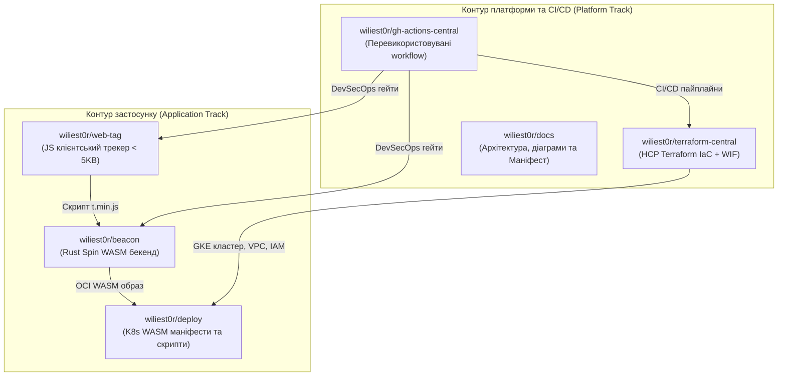
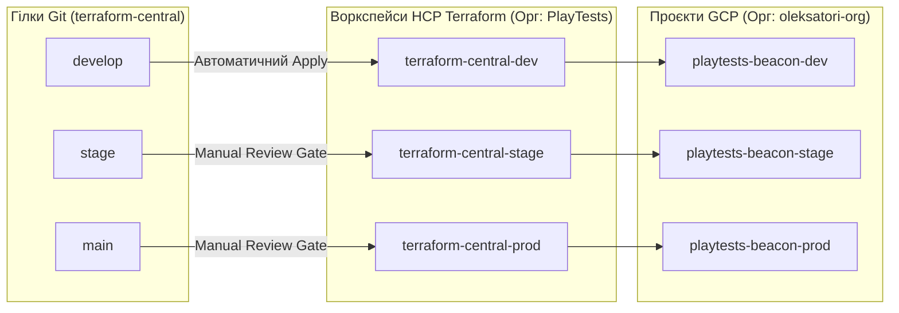
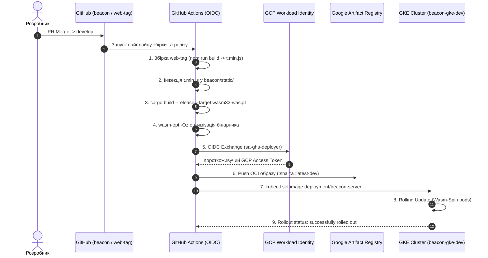

# МАНІФЕСТ: Beacon Analytics — Архітектура Хмарної Інфраструктури (GCP, HCP Terraform & Wasm-Spin GKE)

> **Статус:** Офіційний архітектурний маніфест (Active / Living Document)  
> **Призначення:** Єдине джерело істини (Single Source of Truth, SSOT) щодо цільової архітектури, принципів безпеки, інфраструктурного управління, дорожньої карти та стандартів експлуатації платформи аналітики **Beacon Analytics**.

---

## 1. Стратегічні цілі (Goals & Objectives)

### 1.1. Декларативне управління інфраструктурою (No ClickOps & GitOps)
* **Повна автоматизація (IaC через HCP Terraform):** Усі хмарні ресурси GCP створюються та керуються виключно через код у репозиторії [`wiliest0r/terraform-central`](https://github.com/wiliest0r/terraform-central). Жодних ручних модифікацій через консоль GCP («Zero ClickOps»).
* **Ізоляція радіуса ураження (Blast Radius Reduction):** Відмова від монолітного state-файлу. Чітке розділення на ізольовані оточення (`dev`, `stage`, `prod`) з окремими проєктами в GCP та незалежними воркспейсами в HCP Terraform (`PlayTests`).
* **Абсолютна безпарольність (Keyless Security / Zero Static Secrets):** Повна відмова від експорту статичних сервісних ключів у форматі JSON (`Service Account Keys`). Вся автентифікація (як для HCP Terraform, так і для GitHub Actions) базується виключно на **Workload Identity Federation (OIDC)** із короткоживучими токенами доступу.

### 1.2. Організаційна ієрархія та фабрика проєктів GCP
* **Організація:** Ресурси розміщуються в межах виділеної організації **`oleksatori-org`** (ID: `455342405415`).
* **Ізольовані проєкти за середовищами:**
  * **Dev:** `playtests-beacon-dev` (Project #: `739483964968`) — пісочниця та середовище швидкої розробки.
  * **Stage:** `playtests-beacon-stage` — середовище передрелізного тестування з незмінними (immutable) OCI-тегами.
  * **Prod:** `playtests-beacon-prod` — продуктивне середовище із суворими approval-гейтами та захистом від видалення.
* **Централізований білінг:** Усі проєкти автоматично підключаються до Cloud Billing Account (`01AEB6-EF391A-41CC3C`) із вимкненням дефолтних небезпечних мереж (`auto_create_subnetworks = false`).

### 1.3. Високопродуктивний хмарний WebAssembly (Wasm-Spin) у Kubernetes
* **Нативний запуск WASM:** Застосування платформи **Fermyon Spin** (`wasm-spin` runtime / `containerd-shim-spin-v2` + `Wasmtime`) у складі керованого кластера **Google Kubernetes Engine (GKE)**. Серверні модулі компілюються з Rust у target `wasm32-wasip1`.
* **Наднизький час холодного старту (< 5 мс):** Миттєва ініціалізація WASM-модулів у пам'яті під навантаженням замість секундного прогріву важких контейнерів Linux.
* **Екстремальний FinOps для Dev:**
  * Використання **Zonal GKE Cluster** (`europe-west1-b`), вартість Control Plane якого ($74.40/міс) на 100% покривається щомісячним кредитом **GCP Free Tier**.
  * Робочі вузли пулу `beacon-node-pool-dev` використовують інстанси **`e2-small`** (0.5–2 vCPU, 2 GB RAM) у режимі **Spot VM** (знижка 60–80%).
  * Диски: 20 GB `pd-standard`.
  * Сумарна вартість усієї інфраструктури Dev-середовища: **~$4–$6 на місяць**.

---

## 2. Ключові принципи платформи (Guiding Principles)

| Принцип | Реалізація в Beacon Analytics |
|---|---|
| **Declarative GitOps** | Жодної мутації стану поза Git. Зміни в інфраструктурі розгортаються через гілки `develop`, `stage`, `main` репозиторію `terraform-central`. |
| **Dual-Track Delivery** | Чітке розділення контурів: 1) Інфраструктурний контур (HCP Terraform); 2) Контур застосунку (збірка Web-Tag + WASM Spin, OCI-пуш в Artifact Registry, Rolling Update подів). |
| **Zero Static Secrets** | Жодного JSON-ключа сервісного акаунта в репозиторіях чи змінних середовища. Лише Workload Identity Federation (WIF) за протоколом OpenID Connect (OIDC). |
| **Principle of Least Privilege** | Окремі цільові сервісні акаунти: `sa-terraform-executor` (IaC-виконавець), `sa-gha-deployer` (CI/CD релізи), `sa-beacon-runtime` (запуск подів), `sa-gke-nodes` (читання реєстру та логування). |
| **Extreme FinOps** | Автоматична оптимізація розмірів (Spot VMs, e2-small, Free Tier Zonal кластери, мінімальні розміри сховищ). |
| **Single Source of Truth** | Код репозиторіїв та документація в `docs` є єдиним актуальним джерелом знань про систему. |

---

## 3. Топологія репозиторіїв та GitOps-модель

### 3.1. Структура репозиторіїв проєкту

| Репозиторій | Призначення | Посилання |
| :--- | :--- | :--- |
| **`terraform-central`** | Модулі Terraform та конфігурація середовищ GCP через HCP Terraform | [wiliest0r/terraform-central](https://github.com/wiliest0r/terraform-central) |
| **`beacon`** | Rust WASM/WASI HTTP-сервер для прийому аналітики та роздачі трекера | [wiliest0r/beacon](https://github.com/wiliest0r/beacon) |
| **`web-tag`** | Ультралегкий (< 5 KB) клієнтський скрипт збору метрик | [wiliest0r/web-tag](https://github.com/wiliest0r/web-tag) |
| **`deploy`** | K8s маніфести (Deployment, Service LoadBalancer, RuntimeClass `wasm-spin`) | [wiliest0r/deploy](https://github.com/wiliest0r/deploy) |
| **`gh-actions-central`** | Централізовані шаблони пайплайнів, лінтери, DevSecOps-сканери | [wiliest0r/gh-actions-central](https://github.com/wiliest0r/gh-actions-central) |
| **`docs`** | Архітектурна документація, діаграми, інструкції та цей Маніфест | [wiliest0r/docs](https://github.com/wiliest0r/docs) |

---

### 3.2. Модель воркспейсів HCP Terraform

Інфраструктура репозиторію `terraform-central` організована навколо єдиного дерева коду, де конфігурація для кожного оточення прив'язана до відповідної гілки:

* **`terraform-central-dev`**:
  * Гілка: `develop`
  * Поведінка: **Повністю автоматичний** запуск `plan` та `apply` при кожному мерджі PR (без очікування ручного апруву).
  * Цільовий проєкт: `playtests-beacon-dev`.
* **`terraform-central-stage`**:
  * Гілка: `stage`
  * Поведінка: Speculative Plan на PR, обов'язковий Review Gate (`wiliest0r`) перед застосуванням.
  * Цільовий проєкт: `playtests-beacon-stage`.
* **`terraform-central-prod`**:
  * Гілка: `main`
  * Поведінка: Суворий захист релізу, аудит безпеки, ручне підтвердження перед `apply`.
  * Цільовий проєкт: `playtests-beacon-prod`.

---

## 4. Контур доставки додатку (WASM Package CI/CD & GKE Rollout)

Комплексний процес доставки коду від клієнтського скрипту до працюючого пода в GKE:

### Складові WASM-пакету:
1. **`t.min.js`**: мініфікований клієнтський JS-трекер (< 5 KB), що віддається ендпоінтом `GET /t.min.js` або `GET /client.js` прямо з пам'яті WASM-рантайму.
2. **`beacon_server.wasm`**: компільований та оптимізований модуль Rust, що валідує підписи, розбирає телеметрію та формує структурований потік подій на ендпоінт `POST /v1/sync`.
3. **`spin.toml`**: дескриптор компонентів Spin, що описує прив'язку маршрутів HTTP-тригера до WASM-компонентів.
4. **OCI Image Ref**: `europe-west1-docker.pkg.dev/playtests-beacon-dev/beacon-repo-dev/beacon-server:<TAG>`.

---

## 5. Безпека та критерії успіху (Security & Verification)

1. **Безпека облікових записів (Zero Credential Leakage):**
   * Жодного статичного ключа `credentials.json` у репозиторіях чи секретах GitHub.
   * Усі права надаються на базі ролей IAM (`roles/iam.workloadIdentityUser`, `roles/artifactregistry.writer`, `roles/container.developer`).
2. **Нульовий простій (Zero-Downtime Rolling Update):**
   * Оновлення версії коду здійснюється стандартним механізмом Kubernetes RollingUpdate з перевіркою готовності подів (`readinessProbe`).
3. **Економічна ефективність (FinOps Compliance):**
   * Витрати на одне середовище розробки не перевищують **$6.00/міс**.
4. **Ідемпотентність та відтворюваність:**
   * Будь-яке середовище (`dev`, `stage`, `prod`) може бути розгорнуто з нуля або повторно синхронізовано з коду за менш ніж 10 хвилин.
